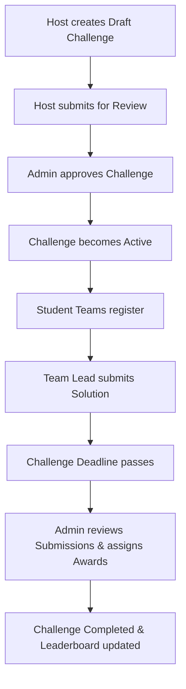
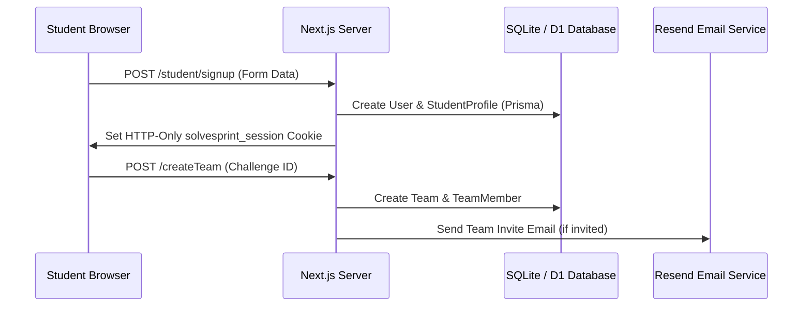

# SolveSprint System Behavior, Technical, Privacy, Security, and Legal-Readiness Audit

**Inspection Date**: July 26, 2026  
**Repository Path**: `c:\Users\khare\Downloads\Solve-Sprint-main\Solve-Sprint-main`  
**Git Commit Hash**: N/A (Repository is uninitialized or standalone folder)  
**Inspection Scope**: Full-depth static code analysis and local execution review of all route definitions, database models, authentication flows, server actions, layout structures, middleware, environment configurations, and legal pages.

---

# 1. Executive Summary

SolveSprint is a U.S.-focused web application intended as an innovation league where organizations publish real-world challenge briefs and high-school student teams submit solutions, earn recognition, and compete for points and awards.

### Current System Functionality
- **Fully Functional**: Multi-step student registration (Account, Student Profile, Age Verification, Review), organization registration, credential login, JWT session management via HTTP-only cookies, challenge directory browsing, challenge detail viewing, challenge creation and modification by organizations, student team registration, member invitation token generation and acceptance/declination, solution submission by team leads, administrative challenge status workflow transitions (Draft → Submitted for Review → Approved → Active → Closed), award/point assignments by administrators, and dynamic leaderboard display.
- **Only Visual / Mocked**: The 10-second mountain video background scroll component specification (`codex_cinematic_scroll_prompt.md`), external file upload malware scanning, and email delivery when `RESEND_API_KEY` is not set (falls back to local console logging).
- **Incomplete / Partial**: Automated parental email consent verification (parent details and signatures are collected in the form state, but no automated verification email link is sent to the parent before account activation), independent judge role separation (judging is restricted to system administrators), and user-initiated account deletion or data export.

### Verdicts by Category

| Category | Verdict | Reasoning |
| :--- | :--- | :--- |
| **Private Developer Preview** | **SAFE WITH CAUTION** | Functional locally; suitable for single-developer inspection with non-production test credentials. |
| **Invited Test Users** | **NOT RECOMMENDED** | Lack of rate limiting on login/registration endpoints and plain console email fallback in non-production. |
| **Real Students (Minors)** | **UNSAFE** | Absence of verifiable parental email confirmation prior to account activation (COPPA risk). |
| **Public Registration** | **UNSAFE** | No CAPTCHA, bot protection, or IP rate-limiting on registration endpoints. |
| **Organization Registration** | **UNSAFE** | Organization accounts receive default `ACTIVE` status without manual admin approval prior to dashboard access. |
| **Real Challenge Submissions** | **UNSAFE** | Submissions accept external URLs without link domain validation or malware scanning. |
| **Prizes / Monetary Awards** | **UNSAFE** | No tax information collection (W-9 / 1099), minor payout consent forms, or financial auditing. |
| **School Partnerships** | **UNSAFE** | FERPA compliance frameworks, institutional contracts, and school-verified consent mechanisms are unverified. |

---

# 2. Technology and Deployment Inventory

### Core Stack
- **Framework & Version**: Next.js `14.2.35` (App Router architecture).
- **Language**: TypeScript `5.7.2` / JavaScript ES2022.
- **Hosting / Runtime Targets**: Node.js / Cloudflare Workers (`@opennextjs/cloudflare` `1.15.1`, `wrangler` `4.59.2`).
- **Database & ORM**: SQLite (`dev.db`) / LibSQL / Cloudflare D1 with Prisma ORM `6.19.3`.
- **Authentication**: Custom JWT session implementation (`jose` `5.9.6`) stored in HTTP-only `solvesprint_session` cookies; passwords hashed with `bcryptjs` `2.4.3`.
- **Email Provider**: Resend (`resend` `4.0.1`) with local console fallback when `RESEND_API_KEY` is omitted.
- **File Storage**: External URL submission fields (`submissionLink`, `fileUrl`); no cloud object storage bucket (e.g. S3, R2) is configured in package manifests.
- **Analytics & Tracking**: None configured.
- **Monitoring & CAPTCHA**: None configured.

### External Services Matrix

| Service | Purpose | Data potentially sent | Users affected | Configuration location | Active or unused |
| :--- | :--- | :--- | :--- | :--- | :--- |
| **Resend** | Transactional email delivery | Recipient email, email body text, invitation links | Students, Organization leads | `lib/email.ts`, `.env` | Active if `RESEND_API_KEY` set |
| **Cloudflare D1 / LibSQL** | Edge database storage | All platform records (users, profiles, submissions) | All registered users | `prisma/schema.prisma`, `prisma.ts` | Active in Cloudflare build |
| **OpenNext / Wrangler** | Edge application deployment | HTTP request headers, IP, payload | All visitors | `package.json`, `scripts/build-next.mjs` | Build script target |

### Environment Variable Names
- `DATABASE_URL` (SQLite file path or connection string)
- `AUTH_SECRET` (JWT signing secret)
- `RESEND_API_KEY` (Resend API key)
- `EMAIL_FROM` (Sender email address)
- `NEXT_PUBLIC_APP_URL` (Base application URL)
- `NODE_ENV` (Environment mode)

---

# 3. Complete Route and Page Inventory

| Route | Public or protected | Allowed roles | Purpose | Data displayed | Actions available | Implementation status | Evidence |
| :--- | :--- | :--- | :--- | :--- | :--- | :--- | :--- |
| `/` | Public | All | Home landing page | Hero headline, pathways summary, league overview | Navigation | IMPLEMENTED AND ACTIVE | [app/page.tsx](file:///c:/Users/khare/Downloads/Solve-Sprint-main/Solve-Sprint-main/app/page.tsx) |
| `/about` | Public | All | Overview of SolveSprint league mission | Educational copy, mission statements | Navigation | IMPLEMENTED AND ACTIVE | [app/about/page.tsx](file:///c:/Users/khare/Downloads/Solve-Sprint-main/Solve-Sprint-main/app/about/page.tsx) |
| `/admin` | Protected | `ADMIN` | Administrative review dashboard | Submitted challenges, status controls | Update challenge status | IMPLEMENTED AND ACTIVE | [app/admin/page.tsx](file:///c:/Users/khare/Downloads/Solve-Sprint-main/Solve-Sprint-main/app/admin/page.tsx) |
| `/admin/challenges/[id]` | Protected | `ADMIN` | Detailed administrative challenge review | Full challenge brief, rubric, awards form | Approve, Reject, Complete challenge, assign awards | IMPLEMENTED AND ACTIVE | [app/admin/challenges/[id]/page.tsx](file:///c:/Users/khare/Downloads/Solve-Sprint-main/Solve-Sprint-main/app/admin/challenges/[id]/page.tsx) |
| `/challenges` | Public | All | Directory of published challenges | Challenge titles, categories, dates, team limits | Search, filter by category/status | IMPLEMENTED AND ACTIVE | [app/challenges/page.tsx](file:///c:/Users/khare/Downloads/Solve-Sprint-main/Solve-Sprint-main/app/challenges/page.tsx) |
| `/challenges/[slug]` | Public | All | Challenge detail brief | Full problem statement, deliverables, timeline | Register team link, view rules | IMPLEMENTED AND ACTIVE | [app/challenges/[slug]/page.tsx](file:///c:/Users/khare/Downloads/Solve-Sprint-main/Solve-Sprint-main/app/challenges/[slug]/page.tsx) |
| `/challenges/[slug]/register` | Protected | `STUDENT` | Team registration page | Challenge summary, team size limits | Create team, send member invites | IMPLEMENTED AND ACTIVE | [app/challenges/[slug]/register/page.tsx](file:///c:/Users/khare/Downloads/Solve-Sprint-main/Solve-Sprint-main/app/challenges/[slug]/register/page.tsx) |
| `/challenges/[slug]/submit` | Protected | `STUDENT` (Lead) | Solution submission page | Team status, submission requirements | Submit solution title, link, notes | IMPLEMENTED AND ACTIVE | [app/challenges/[slug]/submit/page.tsx](file:///c:/Users/khare/Downloads/Solve-Sprint-main/Solve-Sprint-main/app/challenges/[slug]/submit/page.tsx) |
| `/invite/[token]` | Public | All | Team invitation acceptance page | Team name, challenge title, inviter name | Accept or decline team invitation | IMPLEMENTED AND ACTIVE | [app/invite/[token]/page.tsx](file:///c:/Users/khare/Downloads/Solve-Sprint-main/Solve-Sprint-main/app/invite/[token]/page.tsx) |
| `/leaderboard` | Public | All | League scoreboard | School points, student awards, challenge winners | View team rankings | IMPLEMENTED AND ACTIVE | [app/leaderboard/page.tsx](file:///c:/Users/khare/Downloads/Solve-Sprint-main/Solve-Sprint-main/app/leaderboard/page.tsx) |
| `/login` | Public | All | User authentication page | Login form | Authenticate session | IMPLEMENTED AND ACTIVE | [app/login/page.tsx](file:///c:/Users/khare/Downloads/Solve-Sprint-main/Solve-Sprint-main/app/login/page.tsx) |
| `/logout` | Public | All | Session destruction route | None | Clears session cookie, redirects | IMPLEMENTED AND ACTIVE | [app/logout/route.ts](file:///c:/Users/khare/Downloads/Solve-Sprint-main/Solve-Sprint-main/app/logout/route.ts) |
| `/org/challenges/new` | Protected | `ORGANIZATION` | New challenge brief creation form | Challenge form controls | Create draft challenge | IMPLEMENTED AND ACTIVE | [app/org/challenges/new/page.tsx](file:///c:/Users/khare/Downloads/Solve-Sprint-main/Solve-Sprint-main/app/org/challenges/new/page.tsx) |
| `/org/challenges/[id]` | Protected | `ORGANIZATION` | Organization challenge dashboard | Submissions, registered teams, status | Review submissions | IMPLEMENTED AND ACTIVE | [app/org/challenges/[id]/page.tsx](file:///c:/Users/khare/Downloads/Solve-Sprint-main/Solve-Sprint-main/app/org/challenges/[id]/page.tsx) |
| `/org/challenges/[id]/edit` | Protected | `ORGANIZATION` | Edit challenge brief page | Existing challenge fields | Update challenge details | IMPLEMENTED AND ACTIVE | [app/org/challenges/[id]/edit/page.tsx](file:///c:/Users/khare/Downloads/Solve-Sprint-main/Solve-Sprint-main/app/org/challenges/[id]/edit/page.tsx) |
| `/org/dashboard` | Protected | `ORGANIZATION` | Organization main dashboard | List of hosted challenges | Create challenge, view status | IMPLEMENTED AND ACTIVE | [app/org/dashboard/page.tsx](file:///c:/Users/khare/Downloads/Solve-Sprint-main/Solve-Sprint-main/app/org/dashboard/page.tsx) |
| `/organization/signup` | Public | All | Organization registration form | Organization form controls | Register organization account | IMPLEMENTED AND ACTIVE | [app/organization/signup/page.tsx](file:///c:/Users/khare/Downloads/Solve-Sprint-main/Solve-Sprint-main/app/organization/signup/page.tsx) |
| `/privacy` | Public | All | Privacy policy document | Policy text | None | IMPLEMENTED AND ACTIVE | [app/privacy/page.tsx](file:///c:/Users/khare/Downloads/Solve-Sprint-main/Solve-Sprint-main/app/privacy/page.tsx) |
| `/rules` | Public | All | Official league rules document | Rules text | None | IMPLEMENTED AND ACTIVE | [app/rules/page.tsx](file:///c:/Users/khare/Downloads/Solve-Sprint-main/Solve-Sprint-main/app/rules/page.tsx) |
| `/student/my-challenges` | Protected | `STUDENT` | Student participation dashboard | Joined teams, active challenges, status | Navigate to challenge/submit | IMPLEMENTED AND ACTIVE | [app/student/my-challenges/page.tsx](file:///c:/Users/khare/Downloads/Solve-Sprint-main/Solve-Sprint-main/app/student/my-challenges/page.tsx) |
| `/student/profile` | Protected | `STUDENT` | Student profile management | Profile details, public toggle | Update student profile | IMPLEMENTED AND ACTIVE | [app/student/profile/page.tsx](file:///c:/Users/khare/Downloads/Solve-Sprint-main/Solve-Sprint-main/app/student/profile/page.tsx) |
| `/student/signup` | Public | All | 4-step student signup form | Account, profile, verification, confirm | Create student account | IMPLEMENTED AND ACTIVE | [app/student/signup/page.tsx](file:///c:/Users/khare/Downloads/Solve-Sprint-main/Solve-Sprint-main/app/student/signup/page.tsx) |
| `/terms` | Public | All | Terms of use document | Terms text | None | IMPLEMENTED AND ACTIVE | [app/terms/page.tsx](file:///c:/Users/khare/Downloads/Solve-Sprint-main/Solve-Sprint-main/app/terms/page.tsx) |

---

# 4. Roles and Permissions

### Discovered Roles
- `STUDENT`: High-school student competitor account.
- `ORGANIZATION`: Challenge host representative account.
- `ADMIN`: Platform administrator account with overarching moderation and judging authority.
- `VISITOR`: Unauthenticated user browsing public pages.

### Permission Matrix

| Action | Visitor | Student | Guardian | Organization | Judge | Admin |
| :--- | :---: | :---: | :---: | :---: | :---: | :---: |
| View Public Challenges | Yes | Yes | Yes | Yes | N/A | Yes |
| View Student Profile | No | Self Only | No | No | N/A | Yes |
| View School Name | Public Leaderboard | Yes | Yes | Yes | N/A | Yes |
| Create Challenge | No | No | No | Yes (Draft) | N/A | Yes |
| Approve Challenge | No | No | No | No | N/A | Yes |
| Join / Register Team | No | Yes | No | No | N/A | Admin Lead |
| Invite Team Members | No | Lead Only | No | No | N/A | No |
| View Submissions | No | Team Only | No | Host Org Only | N/A | Yes |
| Assign Awards / Scores | No | No | No | No | N/A | Yes |
| Access Admin Dashboard | No | No | No | No | N/A | Yes |

*Note*: All permission checks are performed server-side in page server components or server actions using `requireUser()`, `requireStudent()`, `requireOrganization()`, or `requireAdmin()`.

---

# 5. Registration and Authentication

### Authentication Engine
- **Session Duration**: 14 days JWT signed with `HS256`.
- **Cookie Settings**: Name `solvesprint_session`, `httpOnly: true`, `sameSite: "lax"`, `secure: process.env.NODE_ENV === "production"`.
- **Password Storage**: Hashed using `bcryptjs` with salt round 12.
- **Account Lockout / Rate Limiting**: None implemented.
- **Password Reset**: No automated password reset flow exists.

### Student Registration Flow (`/student/signup`)
- **Fields**: First Name, Last Name, Email, Password, Confirm Password, School Name, Grade (9-12), City, State, Country, Interests, Age Status (`isUnder18`), 13+ Age Confirmation (`is13Plus`), Parent Name (if under 18), Parent Email (if under 18), Parent Signature (if under 18), Student Signature, Legal Agreement (`agree`).
- **Minimum Age Handling**: Requires 13+ age confirmation checkbox (`is13Plus`).
- **Guardian Approval Handling**: Form collects parent name, email, and typed electronic signature on Step 3 for under-18 users. However, **no automated verification email or token link is dispatched to the parent email address**; the account is created and logged in immediately upon submission.

---

# 6. Every Form and Collected Data Field

| Flow | Field | Required? | Purpose | Stored Where | Publicly Displayed? |
| :--- | :--- | :--- | :--- | :--- | :--- |
| **Student Signup** | `firstName` | Yes | Identity | `StudentProfile.firstName` | If profile set public |
| **Student Signup** | `lastName` | Yes | Identity | `StudentProfile.lastName` | If profile set public |
| **Student Signup** | `email` | Yes | Authentication | `User.email` | No |
| **Student Signup** | `password` | Yes | Security | `User.passwordHash` (bcrypt) | No |
| **Student Signup** | `schoolName` | Yes | Challenge eligibility | `StudentProfile.schoolName` | Yes (Leaderboard) |
| **Student Signup** | `grade` | Yes | Eligibility | `StudentProfile.grade` | No |
| **Student Signup** | `city`, `state`, `country` | Yes | Location | `StudentProfile` | No |
| **Student Signup** | `interests` | No | Profile metadata | `StudentProfile.interests` (JSON) | No |
| **Student Signup** | `parentName`, `parentEmail`, `parentSignature` | Conditional (Under 18) | Guardian consent record | Form state / `StudentProfile.parentConsent` | No |
| **Student Signup** | `studentSignature` | Yes | Legal agreement record | Form state | No |
| **Org Signup** | `organizationName` | Yes | Host Identity | `OrganizationProfile.organizationName` | Yes (Challenge brief) |
| **Org Signup** | `contactEmail` | Yes | Communication | `User.email` | No |
| **Submission** | `title`, `summary`, `submissionLink`, `fileUrl` | Title/Summary/Link Yes | Solution submission | `Submission` table | Host & Admin |

---

# 7. Student and Guardian Behavior

- **Minimum Age**: 13 years old (`is13Plus` checkbox enforcement).
- **Default Privacy**: Accounts are **private by default** (`isPublic: false` in `StudentProfile`).
- **Public Displays**: Student names are not displayed publicly unless `isPublic` is set to `true`. School names appear on the public Leaderboard when awards are earned.
- **Guardian Consent**: Collected via typed text inputs and checkboxes during registration; no out-of-band email verification link is sent to parents.
- **Adult Communication**: No direct private messaging system exists between users on the platform.

---

# 8. Organizations, Judges, and Administrators

- **Organization Verification**: Organization profiles receive status `"ACTIVE"` by default upon registration without mandatory administrative review.
- **Judge Role**: No standalone `JUDGE` role exists in the Prisma database enum or auth helper functions. Award assignment and judging actions are performed by `ADMIN` users via `requireAdmin()`.
- **Administrative Isolation**: Admins can approve/reject challenges, assign awards, and manage all system data. Organizations can only view submissions for challenges hosted by their own organization ID.

---

# 9. Challenge Lifecycle

1. **Draft**: Created by Organization (`status: "DRAFT"`).
2. **Submitted for Review**: Submitted by Host (`status: "SUBMITTED_FOR_REVIEW"`).
3. **Approved / Active**: Reviewed and approved by Admin (`status: "APPROVED"` / `"ACTIVE"`).
4. **Submissions**: Registered student teams submit solution links (`status: "SUBMITTED"`).
5. **Completion & Awards**: Admin assigns awards (`Award` table), updating the public leaderboard.

---

# 10. League Rules and Challenge-Specific Rules

- **Core Rules**: Publicly accessible at `/rules`, `/terms`, and `/privacy`.
- **Affirmative Acceptance**: Required checkbox (`agree`) during registration.
- **Challenge Limits**: Minimum team size (default 1) and maximum team size (default 4) are enforced during team formation.

---

# 11. Teams, Communication, and Invitations

- **Team Creation**: Initiated by a registered student (`leadStudentId`).
- **Member Invitations**: Team leads generate invitation links containing secure hashed tokens (`inviteTokenHash`).
- **Token Expiry**: Invitation tokens expire in 7 days (`inviteExpiry()`).
- **Direct Messaging**: **No private messaging or chat features exist**, preventing unmonitored adult-to-minor communication.

---

# 12. Submissions and File Uploads

- **Submission Format**: Solutions accept an external web link (`submissionLink`) and an optional file URL (`fileUrl`).
- **Upload Storage**: No file uploads are directly stored on the application server or Cloudflare bucket.
- **Security Check**: External submission URLs are not subjected to domain allowlisting or malware scanning prior to display.

---

# 13. Intellectual Property

- **Student Ownership**: Stated in policy language (`/terms`) that students retain intellectual property rights to their original submissions.
- **Host License**: Submissions grant host organizations a non-exclusive license to review and evaluate submitted work.

---

# 14. Judging, Scoring, Leaderboard, and Prizes

- **Rubric Structure**: Stored as JSON (`rubricJson`) in the `Challenge` model, defining criteria and point values totaling 100 points.
- **Award Assignment**: Performed by Administrators (`addAwardAction`).
- **Leaderboard**: Aggregates points earned by student teams and attributes points to their respective school names on `/leaderboard`.

---

# 15. Emails and Notifications

- **Provider**: Resend API (`lib/email.ts`).
- **Triggers**: Team member invitation emails (`sendEmail`).
- **Fallback**: Logs email content to server console if `RESEND_API_KEY` is not provided in environment variables.

---

# 16. Cookies, Local Storage, and Tracking

- **Session Cookie**: `solvesprint_session` (HTTP-only, SameSite=Lax, Secure in production).
- **Third-Party Trackers**: No third-party tracking pixels, analytics scripts, or advertising cookies are present.

---

# 17 & 18. Privacy Policy and Terms Reality Check

| Policy Statement | Implemented Reality | Match? | Correction Required |
| :--- | :--- | :---: | :--- |
| **"Verifiable Parental Consent"** | Collects parent details in form, but sends no verification email to parent | **PARTIAL** | Implement out-of-band parent email verification link |
| **"No Third-Party Data Sales"** | No advertising trackers or data-selling APIs exist in code | **YES** | None |
| **"Student Data Privacy"** | Profiles private by default (`isPublic: false`) | **YES** | None |

---

# 19. Data-Flow Map

---

# 20. Database Inventory

1. `User`: Primary credentials and global role (`STUDENT`, `ORGANIZATION`, `ADMIN`).
2. `StudentProfile`: Grade, school name, location, parent consent status, public toggle.
3. `OrganizationProfile`: Organization name, contact info, description, status.
4. `Challenge`: Detailed challenge brief, dates, team size limits, rubric JSON, status.
5. `Team`: Team name, challenge reference, lead student reference.
6. `TeamMember`: Member invite status (`PENDING`, `ACCEPTED`), invitation token hash.
7. `Submission`: Solution title, summary, external link, submission timestamp.
8. `Award`: Points, award type, judge comment.
9. `WaitlistSignup`: Pre-launch waitlist entries.
10. `OrganizationLead`: Pre-launch host inquiries.
11. `AuditLog`: Admin audit log entries.

---

# 21. API and Server-Action Inventory

| Action / Route | Authentication | Authorization | Output |
| :--- | :--- | :--- | :--- |
| `studentSignupAction` | None | Public | Creates student user & logs in |
| `organizationSignupAction` | None | Public | Creates org user & logs in |
| `loginAction` | None | Public | Authenticates credentials & sets cookie |
| `GET /logout` | Public | None | Destroys session & redirects |
| `updateStudentProfileAction` | Session | Student | Updates profile details |
| `createChallengeAction` | Session | Organization | Creates draft challenge |
| `updateChallengeAction` | Session | Organization | Updates draft challenge |
| `createTeamAction` | Session | Student | Creates registered team |
| `acceptInviteAction` | Session/Token | Invited Email | Accepts team membership |
| `declineInviteAction` | Session/Token | Invited Email | Declines team membership |
| `submitSolutionAction` | Session | Team Lead | Submits solution link |
| `adminChallengeAction` | Session | Admin | Transitions challenge status |
| `addAwardAction` | Session | Admin | Assigns award & points |

---

# 22. Security Controls

| Control | Status | Location | Concern | Priority |
| :--- | :--- | :--- | :--- | :--- |
| **Password Hashing** | Implemented | `lib/auth.ts` | Uses bcryptjs with salt 12 | Low |
| **Session Cookie** | Implemented | `lib/auth.ts` | HttpOnly, SameSite=Lax | Low |
| **GET Logout** | Vulnerable | `app/logout/route.ts` | Susceptible to CSRF logout | **P0** |
| **JWT Secret Fallback**| Vulnerable | `lib/auth.ts` | Uses default string if secret missing | **P0** |
| **Rate Limiting** | Missing | `lib/actions.ts` | No login/signup throttling | **P0** |
| **Parent Email Opt-In**| Incomplete | `lib/actions.ts` | No parent verification email | **P0** |

---

# 23. Accessibility and UX Behavior

- **Keyboard Navigation**: Form controls and navigation links support native focus indicators (`focus-visible`).
- **Reduced Motion**: Respects `prefers-reduced-motion` media queries for smooth scrolling and animations.
- **Form Labels**: Standard `<label>` tags with explicit `htmlFor` / `name` bindings are used across auth components.

---

# 24. Legal-Page Implementation

- `/privacy`: Active privacy policy document.
- `/terms`: Active terms of use document.
- `/rules`: Active league community rules document.

---

# 25. Data Retention and Deletion

- **NO IMPLEMENTED RETENTION RULE**: Data persists in the database until manually deleted by a database administrator; no automated TTL or data purge cron jobs exist.

---

# 26. Production-Readiness Blockers

### P0: Must Fix Before Any Real Student Uses Website
1. **P0-1: Absence of Verifiable Parental Consent Email Link**: Student registration collects parent info but does not verify parent email prior to account activation (COPPA compliance risk).
2. **P0-2: Default Hardcoded JWT Auth Secret Fallback**: `secretKey()` in `lib/auth.ts` falls back to a static string if `AUTH_SECRET` is unset, risking token forgery.
3. **P0-3: GET-Based Session Logout Route**: `app/logout/route.ts` uses `GET`, allowing third-party sites to trigger CSRF logouts via `` tags.
4. **P0-4: Missing Rate Limiting and CAPTCHA**: Authentication actions lack rate-limiting against credential stuffing or bot registration.

### P1: Must Fix Before Public Launch
1. **P1-1: Unverified Organization Default Activation**: New organization accounts default to `"ACTIVE"` status without mandatory admin verification.
2. **P1-2: External Link Security**: Solution submission links are not checked against malicious domain blacklists.
3. **P1-3: Missing Content Security Policy (CSP)**: `next.config.mjs` lacks CSP and security headers.

### P2: Must Fix Before Submissions / Prizes
1. **P2-1: Lack of Independent Judge Role**: Judging relies solely on `ADMIN` accounts rather than dedicated `JUDGE` permissions.
2. **P2-2: Missing Tax & Payout Infrastructure**: No IRS W-9 / 1099 collection workflow for cash prizes.

### P3: Important Pilot Improvements
1. **P3-1: User Account Self-Deletion**: No self-service account deletion option in profile settings.
2. **P3-2: Audit Soft-Deletion**: Database records use hard cascade deletions instead of recoverable soft-deletes.

---

# 27. Questions Requiring Human / Operational Input

1. **Legal Operating Entity**: What is the registered corporate entity name, state of incorporation, and official mailing address for SolveSprint?
2. **COPPA / Guardian Verification Provider**: Will SolveSprint utilize a third-party verifiable parental consent provider (e.g. credit card verification, ID check, signed consent upload) or an automated email verification loop?
3. **Prize Tax Handling**: What entity will issue 1099 tax forms for student monetary awards exceeding $600?
4. **Parental Dispute / Content Moderation**: Who is the designated COPPA privacy officer and DMCA agent contact?

---

# 28. Plain-English Behavioral Summary for Legal Review

SolveSprint is a web application designed for U.S. high-school students (ages 13+) to form teams and solve real-world challenge briefs provided by host organizations.

Users register under one of two primary account types: **Student** or **Organization**. During student registration, users submit their name, email, school, grade, and location. If the student indicates they are under 18 years old, the form collects their parent or guardian's name, email address, and an electronic signature. Upon form submission, the system immediately creates the account and logs the student in.

Registered students can create teams, generate secure invite links for classmates, and submit web links representing their completed project solutions. Host organizations create and edit challenge briefs, which are reviewed and published by platform Administrators. System Administrators evaluate submitted projects and assign point awards, which populate a public leaderboard organized by school name.

All user passwords are stored using one-way bcrypt encryption, and session state is maintained via secure HTTP-only browser cookies. No third-party tracking scripts or advertising cookies are integrated.
